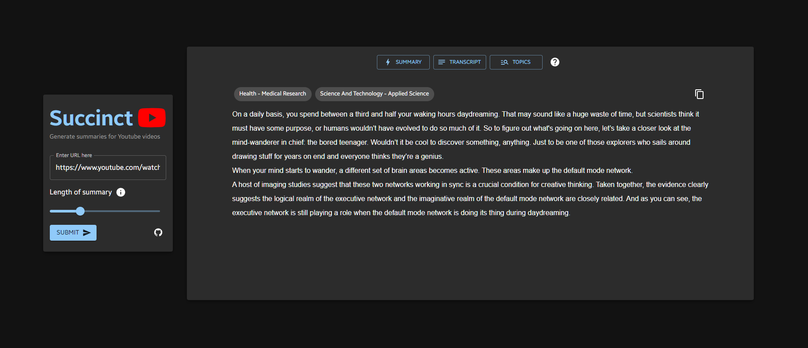

# Succinct - generate summaries for Youtube videos



## General information

Succinct is a fully responsive, progressive web app built with React, TypeScript & Google Cloud Functions. It allows you to quickly summarize the content of a Youtube video and learn about the topics & ideas discussed inside the text. It also allows you to choose your desired length of summary based on the total number of sentences in the video's transcript.

```gcloud_function``` folder holds the Python script that accepts a POST request consisting of the Youtube video URL and a percentage value representing the desired length of summary. It returns a JSON string that includes the summary, transcript and topics pertaining to the video. This script is hosted on a Google Cloud Function and extensively uses MeaningCloud's various APIs

## How to run locally

1) Clone this repository 
2) Sign up for a [MeaningCloud](https://www.meaningcloud.com/developer/login) account to obtain your license key and add it to line 6 of ```gcloud_function/main.py``` file.
3) Set up a Google Cloud Function using the files in ```gcloud_function/``` folder. Authentication is not required but you can add it if you prefer.
4) Run ```npm install``` in the home directory (same directory as this ```README.md``` file) to install the required libraries. 
5) Run ```npm start``` to start the app locally on ```http://localhost:3000```
 
## Feedback

We hope this application will be as useful to you as it has been to us. If you encounter any bugs, issues or have general feedback, please feel free to leave a ticket in the issues section of this repository!

## Built with

* [ReactJS](https://reactjs.org/) - build good-looking, interactive UIs
* [Material UI](https://mui.com/) - extensive component library for React
* [Google Cloud Functions](https://cloud.google.com/functions) - host scripts on the cloud that can be called from anywhere
* [MeaningCloud APIs](https://www.meaningcloud.com) - for text summarization, topic extraction and text classification using their machine learning models

## Attributions

* [Favicon & Logos from Flaticon](https://www.flaticon.com/) - free, high definition icons and images
